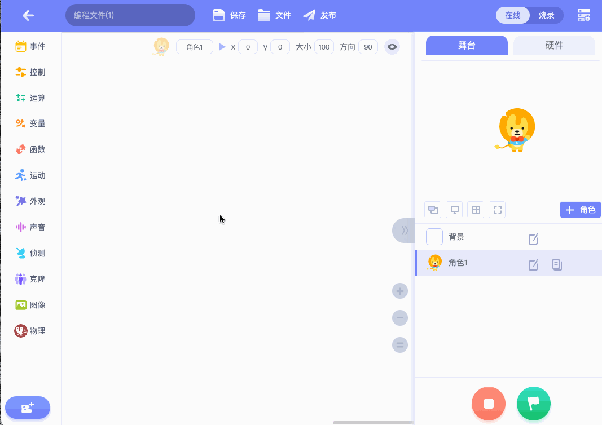

# uCode4 硬件扩展 micro:bit 示例

- [uCode4 硬件扩展 micro:bit 示例](#ucode4-硬件扩展-microbit-示例)
  - [固件](#固件)
  - [快速预览](#快速预览)
  - [主要文件说明](#主要文件说明)
  - [更多](#更多)

## 固件

本扩展使用 scratch 版本的 micro:bit 固件，版本是 1.1.0。

[从scratch官网下载：scratch-microbit-1.1.0.hex](https://downloads.scratch.mit.edu/microbit/scratch-microbit-1.1.0.hex.zip)

项目中已经下载了 hex，路径为`hex/ucode-microbit-1.1.0.hex`。

固件烧录：

- 先通过 USB 将 micro:bit 和电脑相连
- 将 hex 文件复制到 micro:bit 生成的磁盘

## 快速预览

通过git克隆源代码后，分别执行以下命令，可构建出uCode4扩展文件。

> 这里默认使用`yarn`命令，你也可以使用`npm`等命令。

- 1. 安装依赖

```bash
yarn
```

- 2. 创建国际化目录i18n

```bash
yarn i18n
```


- 3. 构建

```bash
yarn compile
```

构建完成后，在`dist/`目录下，`ext.ucdext`文件即是uCode4扩展文件。

在uCode4中使用：
1. [打开uCode4](https://code.ubtrobot.com/)。
2. 点击创建作品--积木编程。
3. 切换到硬件标签，点击`添加硬件`。
4. 在空白处，单击鼠标右键，选择`添加开发者插件`。
5. 在文件选择弹窗中，选择刚编译好的`ext.ucdext`文件。
6. 添加后，点击新增的卡片，即可预览。
7. 插件也可以删除，删除后，请刷新页面。



## 主要文件说明

| 路径                      | 描述                                                           |
| ------------------------- | -------------------------------------------------------------- |
| src/index.js              | 扩展程序入口，注册入口                                         |
| src/block.js              | 扩展积木块定义文件                                             |
| src/menus.js              | 扩展积木块依赖的下拉菜单定义文件                               |
| src/microbit.js           | micro:bit 设备封装类，包含协议、通信、数据解析、数据缓存等功能 |
| src/devices/ble-device.js | micro:bit 蓝牙通信类，发现设备、收发数据。                     |
| static/logo.svg           | 扩展图标                                                       |
| static/manifest.json      | 扩展信息                                                       |

## 更多

有关如何开发uCode硬件扩展，或uCode开放平台的信息，可以跳转到[开放平台文档](https://aiedu.ubtrobot.com/open/docs/01-started/usv.html)进行查阅。
